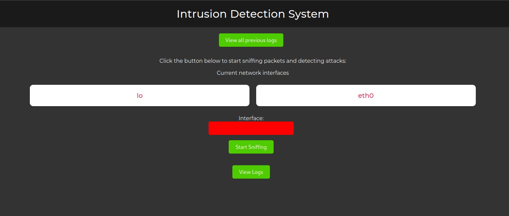
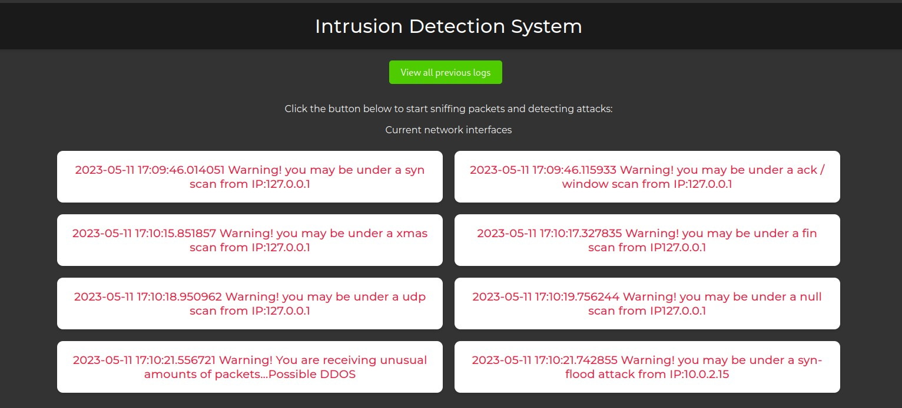
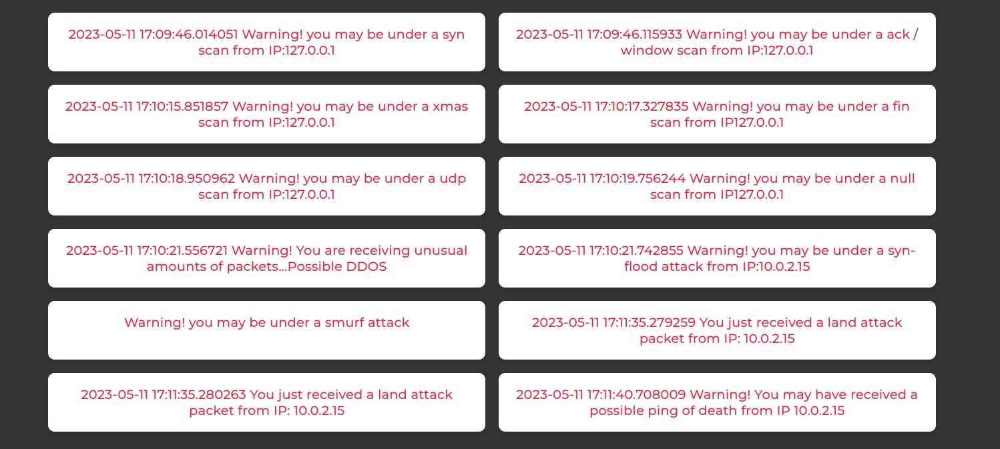

# IDS
An Intrusion Detection System in python using scapy
Detects various network attacks. Especially wi-fi attacks.
(Working to add machine learning to it, would be glad if any of you can help)
---


## Setup
Open two terminals
Start IDS on one terminal and launch attacks from other.

Start flask app of IDS by 

``` 
./start.py
```
Start specific attack files from /ATTACKS on other terminal accordingly. For e.g:
```
./port_scanning.sh <interface IP>
```
## Demo



